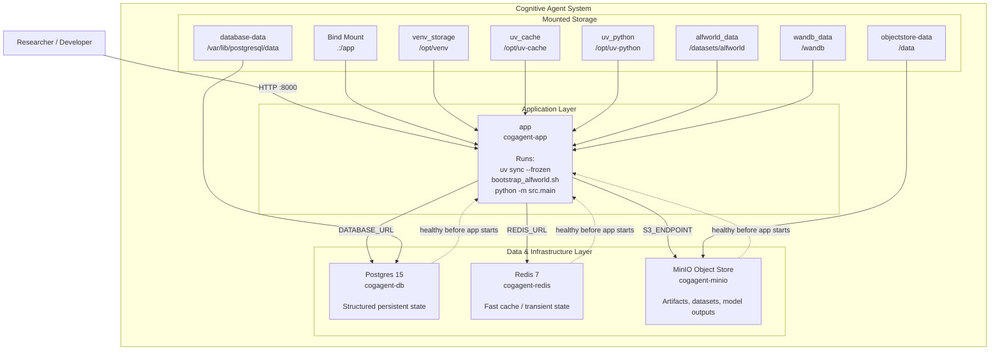
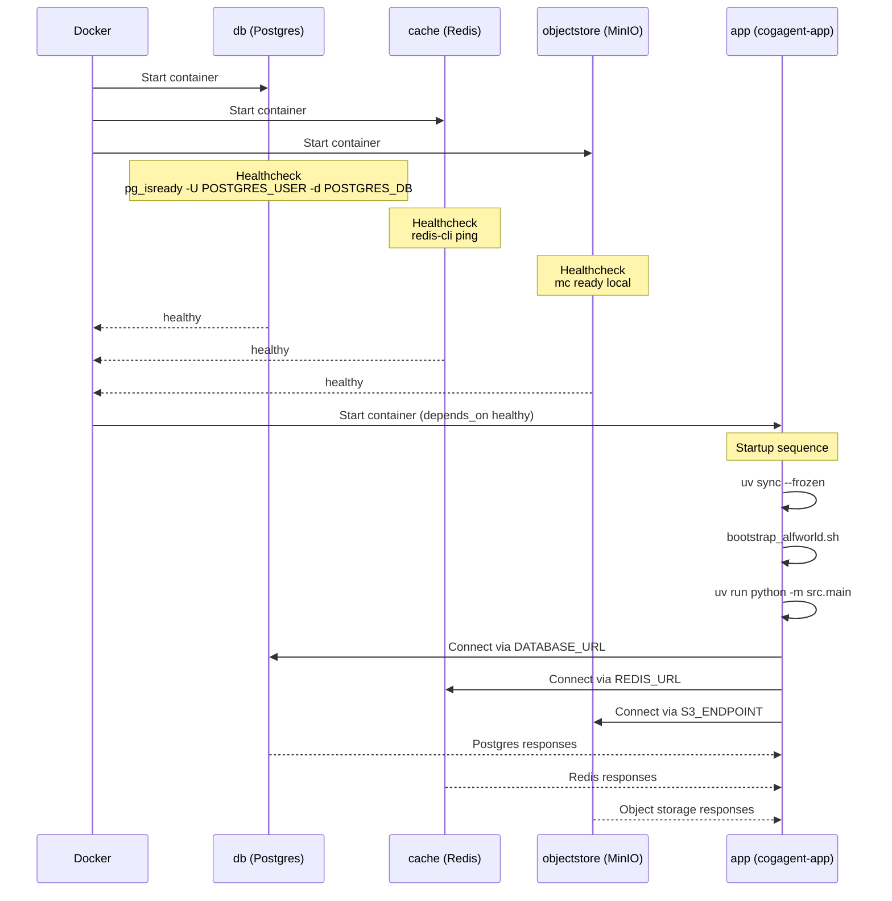

Architecture Diagram

```mermaid
flowchart TB
  %% External actor
  user["Researcher / Developer"]

  %% System boundary
  subgraph system["Cognitive Agent System"]
    direction TB

    subgraph app_layer["Application Layer"]
      app["app<br/>cogagent-app<br/><br/>Runs:<br/>uv sync --frozen<br/>bootstrap_alfworld.sh<br/>python -m src.main"]
    end

    subgraph data_layer["Data & Infrastructure Layer"]
      db["Postgres 15<br/>cogagent-db<br/><br/>Structured persistent state"]
      cache["Redis 7<br/>cogagent-redis<br/><br/>Fast cache / transient state"]
      objectstore["MinIO Object Store<br/>cogagent-minio<br/><br/>Artifacts, datasets, model outputs"]
    end

    subgraph storage_layer["Mounted Storage"]
      source["Bind Mount<br/>.:/app"]
      venv["venv_storage<br/>/opt/venv"]
      uvcache["uv_cache<br/>/opt/uv-cache"]
      uvpython["uv_python<br/>/opt/uv-python"]
      alfworld["alfworld_data<br/>/datasets/alfworld"]
      wandb["wandb_data<br/>/wandb"]
      pgdata["database-data<br/>/var/lib/postgresql/data"]
      miniodata["objectstore-data<br/>/data"]
    end
  end

  %% User interaction
  user -->|"HTTP :8000"| app

  %% App dependencies
  app -->|"DATABASE_URL"| db
  app -->|"REDIS_URL"| cache
  app -->|"S3_ENDPOINT"| objectstore

  %% Health-gated startup
  db -.->|"healthy before app starts"| app
  cache -.->|"healthy before app starts"| app
  objectstore -.->|"healthy before app starts"| app

  %% Volume relationships
  source --> app
  venv --> app
  uvcache --> app
  uvpython --> app
  alfworld --> app
  wandb --> app
  pgdata --> db
  miniodata --> objectstore
```
Startup Lifecycle 

```mermaid
sequenceDiagram
    participant Docker
    participant DB as db (Postgres)
    participant Cache as cache (Redis)
    participant ObjectStore as objectstore (MinIO)
    participant App as app (cogagent-app)

    Docker->>DB: Start container
    Docker->>Cache: Start container
    Docker->>ObjectStore: Start container

    Note over DB: Healthcheck<br/>pg_isready -U POSTGRES_USER -d POSTGRES_DB
    Note over Cache: Healthcheck<br/>redis-cli ping
    Note over ObjectStore: Healthcheck<br/>mc ready local

    DB-->>Docker: healthy
    Cache-->>Docker: healthy
    ObjectStore-->>Docker: healthy

    Docker->>App: Start container (depends_on healthy)

    Note over App: Startup sequence
    App->>App: uv sync --frozen
    App->>App: bootstrap_alfworld.sh
    App->>App: uv run python -m src.main

    App->>DB: Connect via DATABASE_URL
    App->>Cache: Connect via REDIS_URL
    App->>ObjectStore: Connect via S3_ENDPOINT

    DB-->>App: Postgres responses
    Cache-->>App: Redis responses
    ObjectStore-->>App: Object storage responses
```